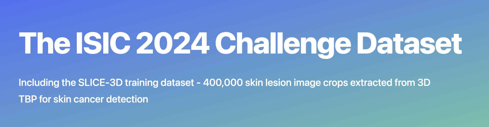

# ISIC2024_Baselines


This repo provides a quick start for the [ISIC2024 challenge](https://challenge2024.isic-archive.com/). It offers baseline implementations for reference. We evaluate representative baselines on a sample of the ISIC2024 dataset and explore practical strategies. For details, see the "ISIC2024_demo.csv Statistics" and "Evaluating Baselines on ISIC2024_demo.csv" sections.
<p align="center">
  
</p>

## Installation
Create the environment and install packages
```
conda create -n env_name python=3.9 -y
conda activate env_name
pip install torch==2.2.2 torchvision==0.17.2 torchaudio==2.2.2 --index-url https://download.pytorch.org/whl/cu118
pip install -r requirements.txt
```

## Preparing datasets

**ISIC2024_demo**: download ISIC2024 images from [here](https://challenge2024.isic-archive.com/) (SLICE-3D, it should contains 401,059 JPEG images)

**ISIC2024_demo_GT**: ISIC2024_demo.csv can be found in this repo.

## Running baselines: 

```
cd CNN_baselines
# This command will train and evaluate weighted ResNet50 with 3 different seeds.
bash run_resnet50.sh
```

```
cd ViT_baselines
# This command will train and evaluate weighted ViT-base with 3 different seeds.
bash run_vit.sh
# This command will train and evaluate weighted DINOv2-base with 3 different seeds.
bash run_dinov2.sh
```


## ISIC2024_demo.csv Statistics

In this repo, we evaluate various models on a subset of ISIC2024, comprising 49,025 images out of the full 401,058 image dataset. The test set includes all images from ACEMID MIA, while the train and validation sets contain images sampled from the remaining attributions.


### Distribution by Split

| Split | Count |
|-------|-------|
| Total | 49,025 |
| Test | 28,665 |
| Train | 16,288 |
| Validation | 4,072 |

### Distribution of Binary Labels for Each Split

| Split | Benign | Malignant |
|-------|--------|-----------|
| Test | 28,632 | 33 |
| Train | 16,000 | 288 |
| Validation | 4,000 | 72 |

### Percentage of Malignant Samples in Each Split

- Test: 0.12%
- Train: 1.77%
- Validation: 1.77%

## Distribution by Attribution in the Demo Dataset

| Attribution | Count |
|-------------|-------|
| ACEMID MIA | 28,665 |
| Memorial Sloan Kettering Cancer Center | 6,979 |
| Department of Dermatology, Hospital Clínic de Barcelona | 5,789 |
| University Hospital of Basel | 3,633 |
| Frazer Institute, The University of Queensland, Dermatology Research Centre | 2,838 |
| ViDIR Group, Department of Dermatology, Medical University of Vienna | 682 |
| Department of Dermatology, University of Athens | 439 |

## Distribution of Binary Labels for Each Attribution in the Demo Dataset

| Attribution | Benign | Malignant |
|-------------|--------|-----------|
| ACEMID MIA | 28,632 | 33 |
| Department of Dermatology, Hospital Clínic de Barcelona | 5,717 | 72 |
| Department of Dermatology, University of Athens | 433 | 6 |
| Frazer Institute, The University of Queensland | 2,757 | 81 |
| Memorial Sloan Kettering Cancer Center | 6,805 | 174 |
| University Hospital of Basel | 3,620 | 13 |
| ViDIR Group, Department of Dermatology, Medical University of Vienna | 668 | 14 |

## Evaluating Baselines on ISIC2024_demo.csv

### Test Results

Model performance may vary depending on hardware. We conduct all experiments on single RTX6000Ada GPU.

| Model | Confusion Matrix |  ROC AUC  | Specificity | Sensitivity |
|-------|------------------|:---------:|:-----------:|:-----------:|
| ResNet50 (non-weighted) | TN: 26890  FP: 1742<br>FN: 31     TP: 2  | 0.7300 (±0.13)  |   0.9795 (±0.03)  |   0.0200 (±0.03)   |
| ResNet50 (weighted)     | TN: 24087  FP: 4545<br>FN: 10     TP: 23 | 0.8278 (±0.03)  |   0.8648 (±0.08)   |   0.6061 (±0.09)  |
| EfficientNet-B1 (weighted) | TN: 26344  FP: 2288<br>FN: 15     TP: 18 | 0.8069 (±0.01) |   0.9366 (±0.001)   |   0.4848 (±0.08)   |
| EfficientNet-B7 (weighted) | TN: 26790  FP: 1842<br>FN: 17     TP: 16 | 0.8538 (±0.04) |   0.9459 (±0.02)   |   0.4646 (±0.03)   |
| ViT_base (weighted) | TN: 24664  FP: 4968<br>FN: 12     TP: 21 | 0.8342 (±0.05) |   0.8612 (±0.11)   |   0.6465 (±0.12)   |
| DINOv2-base (weighted) | TN: 18866  FP: 9766<br>FN: 10     TP: 23 | 0.7437 (±0.24) |   0.6077 (±0.49)   |   0.7475 (±0.20)   |

### Initial Observations

1. ISIC2024 presents a highly imbalanced machine learning task. Training a model using cross-entropy loss alone results in very low sensitivity.
2. We found that simple random weighted sampling is very effective in alleviating this issue.
3. Adjusting the prediction threshold should also be useful for improving sensitivity.

### Key Findings

- The non-weighted ResNet50 model achieves high specificity but fails to detect any malignant cases (0% sensitivity).
- Weighted sampling significantly improves sensitivity for various models.
- The weighted ResNet50 and weighted ViT-base model shows the best balance between specificity and sensitivity.

### Future Directions

- Experiment with different sampling techniques and loss functions designed for imbalanced datasets.
- Fine-tune the prediction threshold to optimize the trade-off between specificity and sensitivity.
- Explore ensemble methods combining multiple models to potentially improve overall performance.

## Credit
The baselines are provided by the [AIM lab](https://www.monash.edu/it/aimh-lab) and [MMAI](https://www.monash.edu/mmai-group), led by A/Prof. [Zongyuan Ge](https://scholar.google.com.au/citations?user=Q0gUrcIAAAAJ&hl=en) from Monash University.

#### Contributors

- [Siyuan Yan](https://scholar.google.com/citations?user=LGcOLREAAAAJ&hl=en) (siyuan.yan@monash.edu.au)
- [Zhonghua Wang] (https://scholar.google.com/citations?hl=en&user=6I5t_3wAAAAJ)


  


